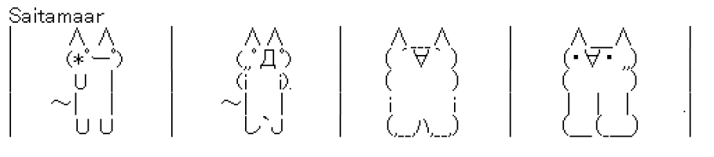
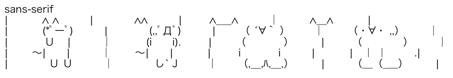

# Saitamaar

Saitamaar is a font designed specifically for ASCII art. It is particularly optimized for displaying Japanese SJIS-Art (Shift JIS Art). This font was developed by 、[keageさん](https://github.com/keage) and is provided under the public domain. This project provides the OTF files for Saitamaar and facilitates its continuous build process.

## Features of Saitamaar Font

Saitamaar is designed to accurately display Japanese ASCII art (SJIS-Art) without any distortion. Below are comparison images showing the application of Saitamaar font and the distortion when using a typical sans-serif font.

- Example using Saitamaar Font:

- Example of distortion with a sans-serif font:

## Font Files

The Saitamaar font files are stored in the "fonts" directory, available in both TrueType (.ttf) and WOFF2 (.woff2) formats.

## Source Files

The "sources" directory contains glyph files for each set of the font and project files used for generating various subsets.

## License

This font is provided in the public domain, allowing free use, modification, and redistribution.
