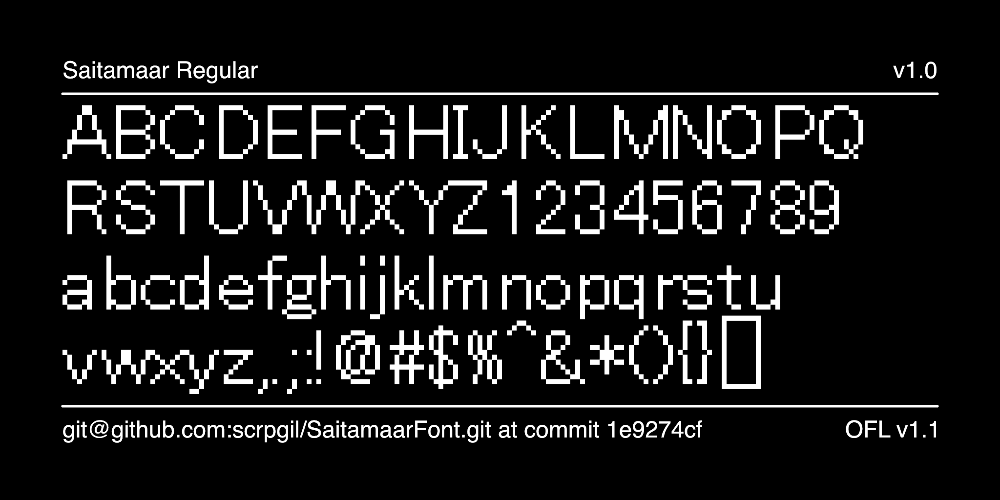

# Saitamaar

Saitamaar font is an ASCII art font. It provides a font width suitable for drawing Japanese SJIS-Art.
Saitamaar is a font created by [@keage](https://twitter.com/keage) and is available in the public domain.
I created this repository as a project to enable continuous builds with Saitamaar's OTF files.

## source file

The src directory contains glyph files for each set of fonts, as well as project files used to output different subsets.

## License

This font is public domain.