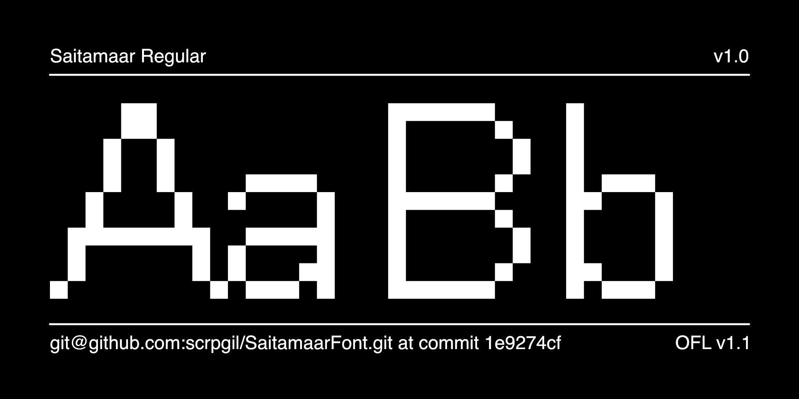
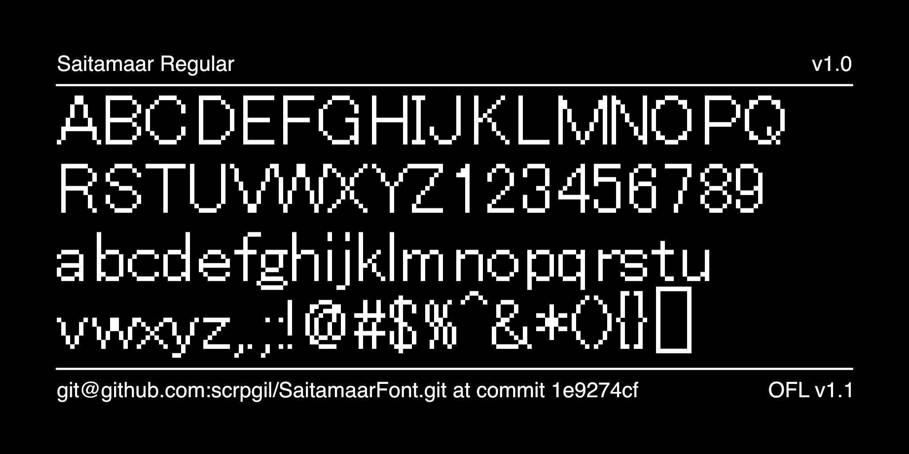
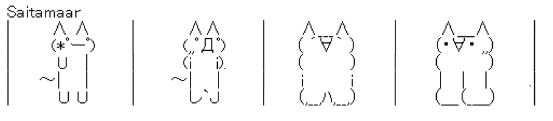
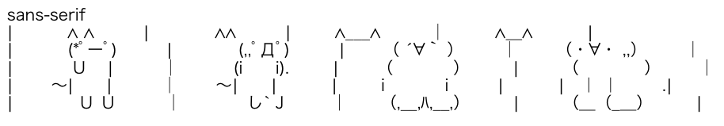

# Saitamaar

Saitamaarフォントはアスキーアート用フォントです。日本のSJIS-Artを描画するのに適したフォント幅を提供してくれます。
Saitamaarは[keageさん](https://github.com/keage)によって作成されたフォントで、パブリックドメインで提供されています。
このリポジトリは、SaitamaarのOTFファイルと継続的ビルドを可能にするプロジェクトとして作成しました。

## AsciiArtの表示について
Saitamaarは、日本語フォントで作られたアスキーアート（SJIS-Art）を崩れることなく表示できます。
下記はSaitamaarフォントの適用例です。

参考までにsans-serifを使用し、表示崩れしてる場合も載せておきます。

## Font

Saitamaarフォントファイルは、fontsディレクトリにあります。TrueTypeファイルとWOFF2ファイルの両方が利用可能です。

## ソースファイル

srcディレクトリには、フォントの各セットのグリフファイルと、さまざまなサブセットの出力に使用されるプロジェクト ファイルが含まれています。

## ライセンス

このフォントはパブリックドメインです。